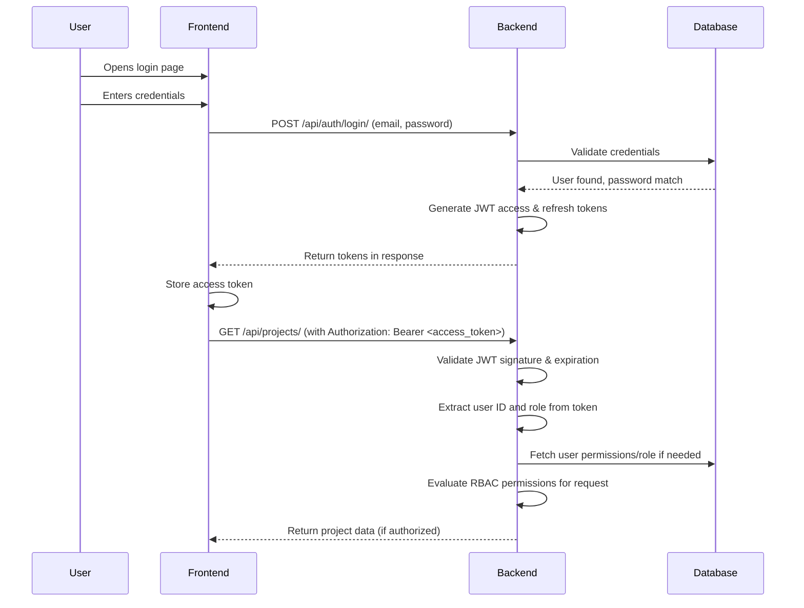
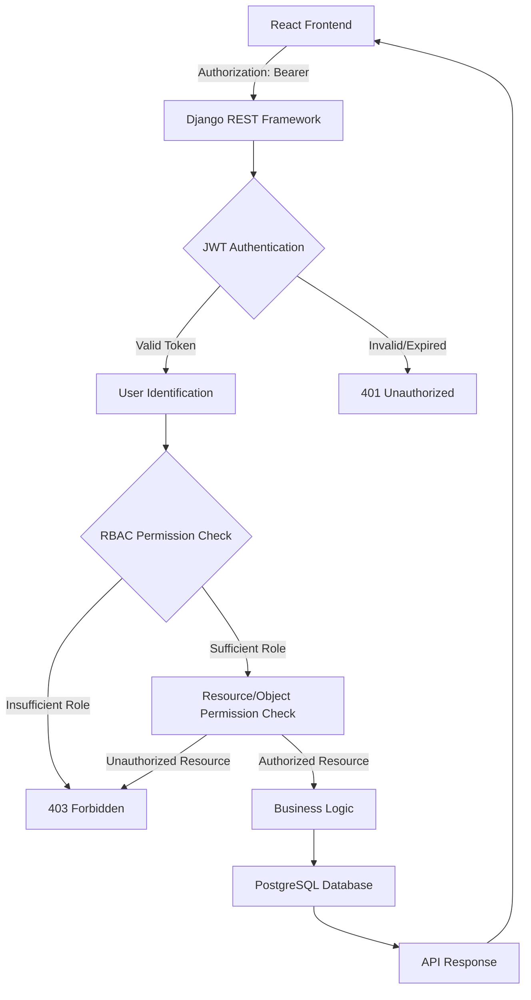

# Authentication Architecture

## 1. Authentication Architecture Overview

Authentication is the process of verifying the identity of a user, device, or system. In the SME Project Management System, authentication ensures that users are who they claim to be before granting access to system resources.

Authorization is the process of determining what authenticated users are allowed to do. Once a user's identity is verified, authorization determines their access level and permissions within the system.

JWT (JSON Web Token) is an open standard (RFC 7519) that defines a compact and self-contained way for securely transmitting information between parties as a JSON object. JWTs are used for authentication and information exchange in the SME Project Management System.

RBAC (Role-Based Access Control) is a method of regulating access to computer or network resources based on the roles of individual users within an organization. In this system, RBAC is used to enforce permissions based on the three approved user roles: Admin, Project Manager, and Team Member.

These components work together as follows:
1. Users authenticate via login credentials (email/password)
2. Upon successful authentication, the system issues JWT tokens containing user identity and role information
3. For each subsequent request, the JWT is validated to confirm authentication
4. The user's role is extracted from the JWT and used to evaluate RBAC permissions
5. Access to resources is granted or denied based on the user's role and the requested operation

## 2. JWT Authentication Flow

The complete JWT authentication flow in the SME Project Management System is as follows:

1. User opens login page
2. User submits credentials (email and password)
3. React frontend sends login request to backend API endpoint
4. Django REST Framework receives request at the authentication endpoint
5. Credentials are validated against stored hashed passwords in the database
6. Upon successful validation, JWT tokens (access and refresh) are issued
7. Frontend receives authentication response containing the tokens
8. Frontend stores the access token (typically in memory or secure storage) and uses it for protected API requests by including it in the Authorization header
9. Backend receives the request with JWT and validates the token signature and expiration
10. Backend identifies the authenticated user from the token payload (user ID)
11. Backend determines the user's role from the token payload or associated database record
12. RBAC permissions are evaluated based on the user's role and the requested operation
13. Request is allowed if the user has sufficient permissions, otherwise rejected

### Token Details

**Access Token**: Short-lived JWT used for authenticating API requests. Contains user identification and role information.

**Refresh Token**: Long-lived JWT used to obtain new access tokens without requiring re-authentication. Stored securely and rotated for security.

**Token Expiration**: Access tokens expire after a short duration (e.g., 15-30 minutes) to limit the window of potential misuse. Refresh tokens expire after a longer duration (e.g., 7 days).

**Token Refresh**: When an access token expires, the client uses the refresh token to obtain a new access token from the token refresh endpoint.

**Invalid Token**: A token with incorrect signature, malformed structure, or invalid claims results in authentication failure (401 Unauthorized).

**Expired Token**: A valid token that has passed its expiration time results in authentication failure (401 Unauthorized), requiring token refresh or re-authentication.

**Authentication Failure**: Occurs when credentials are invalid, tokens are missing/invalid/expired, or user account is disabled/locked.

**Authorization Failure**: Occurs when an authenticated user attempts to access a resource or perform an operation not permitted by their role (403 Forbidden).

### Mermaid Sequence Diagram



## 3. JWT Token Lifecycle

The JWT token lifecycle in the SME Project Management System encompasses the following stages:

**Login**: User submits credentials via the login interface. Upon successful validation, the authentication service issues both an access token and a refresh token.

**Token Issuance**: The system creates a signed JWT containing:
- User identifier (user ID)
- Role assignment
- Issued at timestamp
- Expiration timestamp
- Any additional claims required for authorization

**Access Token Usage**: The access token is included in the Authorization header of subsequent API requests as a Bearer token. The backend validates the token on each request to establish user identity.

**Access Token Expiration**: After the configured expiration time (typically 15-30 minutes), the access token becomes invalid for authentication purposes. Any request using an expired token will be rejected with a 401 Unauthorized response.

**Refresh Token Usage**: When the access token expires, the client submits the refresh token to the token refresh endpoint to obtain a new access token. The refresh token is validated for signature, expiration, and whether it has been revoked.

**New Access Token**: Upon successful refresh token validation, the system issues a new access token (and optionally a new refresh token as part of token rotation).

**Logout/Session Termination**: Upon user logout, the client discards the stored tokens. Note that JWT logout does not automatically invalidate already-issued tokens unless the architecture explicitly implements token blacklisting. In the current architecture, tokens remain valid until their natural expiration, following the stateless JWT principle. For enhanced security, a token blacklist or revocation list could be implemented in future versions.

The architectural concept distinguishes between the theoretical JWT properties (stateless, self-contained tokens) and implementation details (specific expiration times, storage mechanisms, refresh strategies).

## 4. RBAC Architecture

Role-based authorization in the SME Project Management System operates by assigning permissions to roles rather than individual users, then assigning users to appropriate roles.

**The Three Approved Roles**:
1. **Admin**: System owner with full access to all modules and administrative functions
2. **Project Manager**: Manages assigned projects with permissions for project-level operations
3. **Team Member**: Executes assigned tasks with permissions limited to their assigned work

**How Roles Are Associated with Users**: During user registration or administration, each user is assigned exactly one role from the three approved options. This role assignment is stored in the user's profile in the database and is included in the JWT payload upon authentication.

**How Backend Authorization Is Enforced**: The Django REST Framework backend uses custom permission classes that:
1. Extract the user's role from the validated JWT or user model
2. Compare the user's role against required permissions for the requested endpoint/action
3. Allow the request if the user's role has sufficient privileges, otherwise return 403 Forbidden

**Endpoint-Level Authorization**: Different API endpoints have different role requirements. For example:
- Admin-only endpoints: User management, system settings
- Project Manager endpoints: Project creation/update, task assignment within assigned projects
- Team Member endpoints: Task updates for assigned tasks, time tracking

**Object/Resource-Level Authorization Where Required**: In addition to endpoint-level checks, certain operations require verification that the user has specific rights to a particular resource:
- Project Managers can only modify projects assigned to them
- Team Members can only update tasks assigned to them
- Users can only view invoices for projects they are associated with
- Budget modifications are restricted to project owners/managers

This layered approach ensures both broad role-based restrictions and fine-grained resource-specific permissions.

## 5. Authentication API Endpoints

| Endpoint | Method | Purpose | Authentication | Role |
| -------- | ------ | ------- | -------------- | ---- |
| `/api/auth/register/` | POST | User registration | None | Any (creates new user with default role) |
| `/api/auth/login/` | POST | User login and token issuance | None | Any (validates credentials) |
| `/api/auth/token/refresh/` | POST | Obtain new access token using refresh token | Refresh token required | Any (validates refresh token) |
| `/api/auth/logout/` | POST | User logout (token invalidation) | Access token required | Any (clears client-side tokens) |
| `/api/auth/profile/` | GET | Retrieve current user profile | Access token required | Any (returns own profile) |
| `/api/auth/profile/` | PUT/PATCH | Update current user profile | Access token required | Any (updates own profile) |
| `/api/auth/password/reset/` | POST | Request password reset | None | Any (initiates reset process) |
| `/api/auth/password/reset/confirm/` | POST | Confirm password reset with token | None | Any (completes reset) |

Note: While the logout endpoint exists, token invalidation on the server-side would require a blacklisting mechanism. The current implementation relies on client-side token removal and short access token expiration for security.

## 6. Authorization / Permission Matrix

| Permission Category | Admin | Project Manager | Team Member |
|---------------------|-------|-----------------|-------------|
| **Authentication** | | | |
| Login / Logout | ✓ | ✓ | ✓ |
| Password Change | ✓ | ✓ | ✓ |
| Password Reset | ✓ | ✓ | ✓ |
| **Projects** | | | |
| Create Project | ✓ | ✓* | — |
| View All Projects | ✓ | — | — |
| View Assigned Projects | ✓ | ✓ | ✓ |
| Update Project | ✓ | ✓* | — |
| Delete / Archive Project | ✓ | ✓* | — |
| **Tasks** | | | |
| Create Task | ✓ | ✓* | — |
| View All Tasks | ✓ | — | — |
| View Assigned Tasks | ✓ | ✓ | ✓ |
| Update Task | ✓ | ✓* | ✓** |
| Delete Task | ✓ | ✓* | — |
| **Team Allocation** | | | |
| View Team Members | ✓ | ✓* | ✓ |
| Assign Users to Projects | ✓ | ✓* | — |
| Remove Users from Projects | ✓ | ✓* | — |
| View Workload Allocation | ✓ | ✓* | — |
| **Budgets** | | | |
| Create Budget | ✓ | ✓* | — |
| View Budget | ✓ | ✓* | ✓* |
| Update Budget | ✓ | ✓* | — |
| Record Expenses | ✓ | ✓* | — |
| **Invoices** | | | |
| Create Invoice | ✓ | ✓* | — |
| View Invoice | ✓ | ✓* | ✓* |
| Update Invoice | ✓ | ✓* | — |
| Send Invoice | ✓ | — | — |
| Record Payment | ✓ | ✓* | — |
| **Dashboard & Analytics** | | | |
| View Organizational Dashboard | ✓ | — | — |
| View Project Dashboard | ✓ | ✓* | ✓* |
| View Personal Dashboard | ✓ | ✓ | ✓ |
| Access Financial Reports | ✓ | ✓* | — |

**Legend**:
- ✓ = Allowed
- — = Not allowed
- * = Scoped to relevant projects only (assigned projects for PM, assigned tasks for TM)
- ** = Update limited to status/progress fields for assigned tasks

**Notes**:
- Admin has full access to all system functions
- Project Manager permissions are limited to projects they are assigned to manage
- Team Member permissions are limited to tasks assigned to them and their own profile
- Financial visibility (budgets/invoices) for Project Managers and Team Members is restricted to their assigned projects
- Administrative functions (user management, role assignment, system settings) are Admin-only

## 7. Protected Request Flow

The flow for a normal protected API request in the SME Project Management System is as follows:

```
React Frontend
→ JWT Access Token (in Authorization header)
→ Django REST Framework
→ JWT Authentication (validates token signature & expiration)
→ User Identification (extracts user ID from token payload)
→ RBAC Permission Check (validates user role against endpoint requirements)
→ Resource/Object Permission Check (validates user has rights to specific resource)
→ Business Logic (executes requested operation)
→ PostgreSQL (reads/writes data)
→ API Response (returns data or status)
```

### Mermaid Diagram



## 8. Security Considerations

The SME Project Management System implements several security considerations to protect authentication and authorization mechanisms:

**Password Hashing**: User passwords are stored using a strong, one-way hashing algorithm (bcrypt or Argon2) with salt to prevent recovery of plain-text passwords even if the database is compromised.

**JWT Signing**: Tokens are signed using a strong secret key (HS256) or asymmetric algorithm (RS256) to prevent tampering. The signing key is stored securely and never exposed in client-side code or public repositories.

**Access Token Expiration**: Short-lived access tokens (15-30 minutes) limit the potential damage from token theft. This reduces the window of opportunity for attackers to use stolen tokens.

**Refresh Token Security**: Refresh tokens are stored securely (HttpOnly cookies or secure storage) and rotated upon use to prevent replay attacks. Refresh token expiration is longer (e.g., 7 days) but still limited to reduce risk.

**HTTPS**: All authentication-related communications occur over HTTPS to prevent credential and token interception in transit.

**Authentication Errors**: Authentication failures return generic messages (e.g., "Invalid credentials") to avoid revealing whether a username exists or not, preventing user enumeration attacks.

**Authorization Errors**: Authorization failures return 403 Forbidden without detailing why access was denied, preventing information leakage about system structure.

**Sensitive Information Protection**: Authentication tokens, password hashes, and other sensitive data are never included in error messages, logs, or client-side code exposed to users.

**Least Privilege**: The RBAC system implements least privilege principles by granting users only the permissions necessary to perform their assigned responsibilities, minimizing the potential impact of compromised accounts.

The architecture avoids introducing unnecessary third-party services or features, relying on industry-standard JWT and RBAC implementations within the Django REST Framework ecosystem.

## 9. HTTP Authentication/Authorization Responses

The architectural meaning of common HTTP responses in the context of authentication and authorization:

**200 OK**: Standard successful response for GET, PUT, PATCH requests when the operation completes successfully. For authentication, indicates successful login or token refresh.

**201 Created**: Returned when a new resource is successfully created via POST request. Relevant for user registration, where a new user account is created.

**400 Bad Request**: Indicates client-side error such as malformed request, missing required fields, or invalid input data. Used for validation errors during login (missing credentials) or registration (invalid email format, weak password).

**401 Unauthorized**: Indicates authentication failure. Returned when:
- No authentication credentials are provided
- Provided credentials are invalid (incorrect email/password)
- JWT token is missing, malformed, or has invalid signature
- JWT token has expired
- User account is deactivated or locked

**403 Forbidden**: Indicates authorization failure. Returned when:
- User is authenticated (valid JWT) but lacks sufficient permissions for the requested operation
- User's role does not permit access to the specific resource or endpoint
- User attempts to perform an action not allowed by their role assignment

**404 Not Found**: Indicates that the requested resource does not exist. Not specifically an authentication/authorization error, but may occur when accessing user-specific resources that don't exist or when endpoint routing fails.

**Key Distinction**:
- **401 Unauthorized**: You are not authenticated (or your authentication has failed/expired). The system does not know who you are.
- **403 Forbidden**: You are authenticated (the system knows who you are) but you don't have permission to perform the requested action.

## 10. Architecture Decisions

The major architectural decisions made for the SME Project Management System authentication system:

**JWT**: Chosen for its stateless nature, scalability, and suitability for RESTful APIs. JWT enables horizontal scaling of authentication servers since no server-side session storage is required. The tokens contain sufficient information (user ID, role) for authorization decisions without database lookups on every request.

**RBAC**: Selected over alternatives like ABAC (Attribute-Based Access Control) or ACLs (Access Control Lists) for its simplicity, ease of administration, and suitability for the defined user roles. RBAC aligns well with the hierarchical structure of SME organizations and provides clear, auditable permission boundaries.

**API Authentication**: JWT Bearer token authentication in the Authorization header was chosen over session-based authentication or API keys for its statelessness, compatibility with SPA (Single Page Application) frontends, and standard implementation in Django REST Framework.

**Permission Enforcement**: Implemented through custom Django REST Framework permission classes that check user roles and object ownership. This approach provides centralized, reusable authorization logic that can be applied consistently across all API endpoints.

**Role Handling**: Roles are stored as part of the user model and included in JWT tokens for efficient authorization checks. Role assignment is managed through the Admin interface, ensuring that only Administrators can modify role assignments, maintaining security and control.

These decisions balance security, usability, scalability, and maintainability while aligning with the project's requirements and constraints.

## 11. Traceability

This authentication architecture traces back to the following project documentation:

**Project Vision (01_Project_Vision.md)**:
- Cross-Cutting Capabilities section explicitly mentions "Role-Based Access Control (RBAC)" as a core feature
- Technology Stack section specifies "Django Allauth + SimpleJWT" for authentication
- Objectives include "Implement Multi-Role RBAC" (OBJ-01) with 3 distinct roles and granular permissions

**Project Scope (02_Project_Scope.md)**:
- In Scope section includes "Authentication" and "Role-Based Access Control (RBAC)" as core modules
- Specifies three supported user roles: Admin, Project Manager, Team Member
- Defines role-specific permissions and system access restrictions

**Functional Requirements (03_Functional_Requirements.md)**:
- Authentication section (FR-AUTH-001 through FR-AUTH-018) covers user registration, login, password handling, JWT issuance, role assignment, and RBAC enforcement
- Specifically requires JWT issuance after successful authentication (FR-AUTH-012)
- Mandates role-based access control for protected operations (FR-AUTH-016, FR-AUTH-017)

**Non-Functional Requirements (04_Non_Functional_Requirements.md)**:
- Security section includes NFR-SEC-002 (JWT authentication) and NFR-SEC-003 (RBAC enforcement)
- Requires secure password hashing (NFR-SEC-001) and secure transmission of credentials (NFR-SEC-007)
- Specifies authentication token invalidation after logout (NFR-SEC-010)

**User Roles (05_User_Roles.md)**:
- Defines the three approved roles with detailed responsibilities, permissions, and restrictions
- Provides the foundation for the permission matrix in Section 6 of this document

**User Stories (06_User_Stories.md)**:
- Authentication stories for all three roles (US-001, US-014, US-026) establish the need for secure login
- Includes password change and reset functionality (US-002, US-010)

**System Modules (07_System_Modules.md)**:
- Authentication Module section details features including user registration, secure login, password hashing, logout, RBAC, and authorization
- Describes interactions with other modules, showing how authentication provides user identity and role information throughout the system

**Day 10 Database Design**:
- While not explicitly reviewed in this session, the authentication architecture aligns with expected database design for user models, role assignments, and token storage
- The JWT approach implies a user table with fields for email, password hash, role, and related authentication data

This documentation maintains consistency with all specified source documents while providing a comprehensive technical specification for the authentication and authorization architecture.